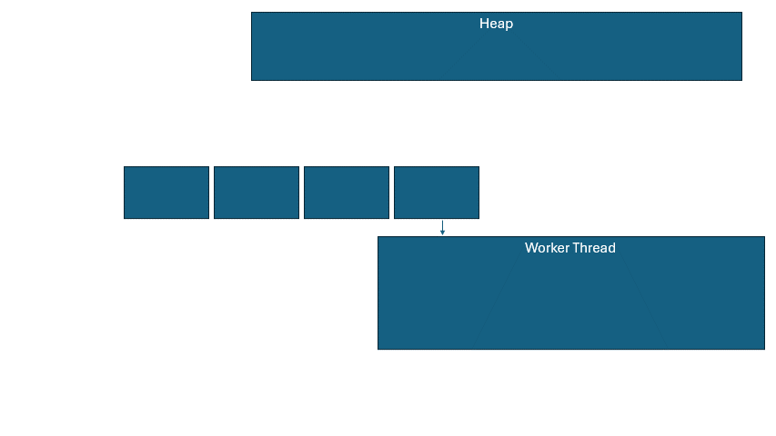
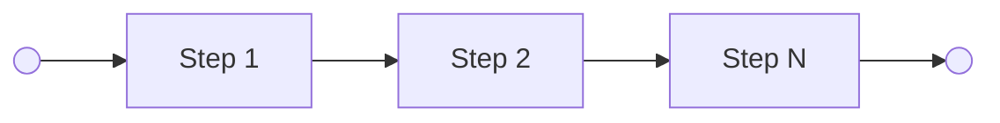
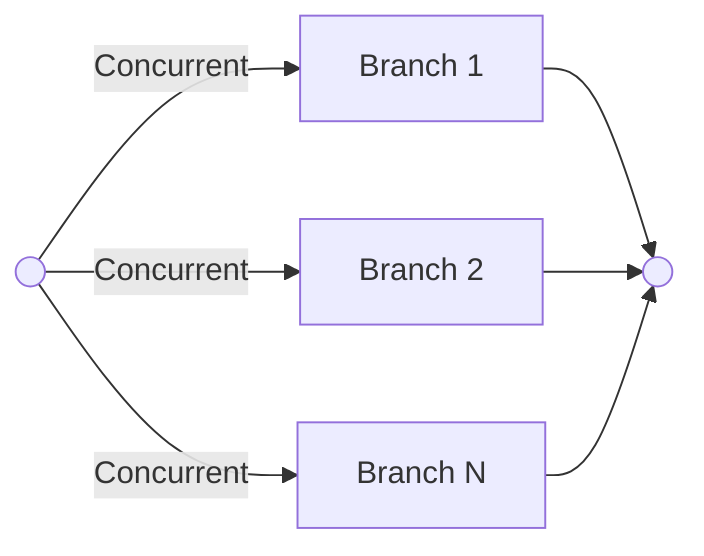
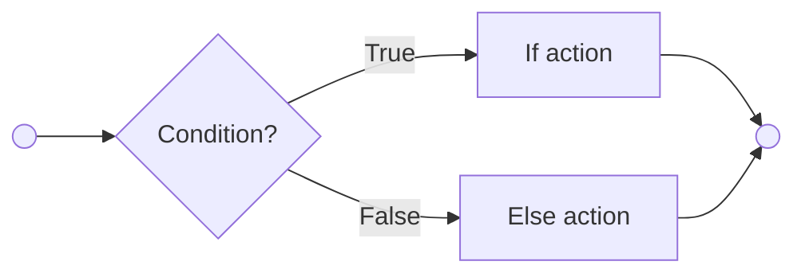
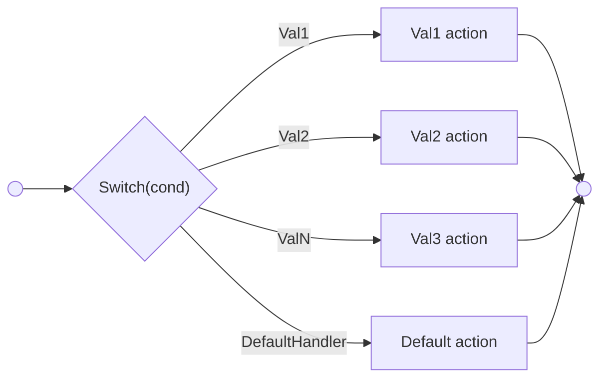
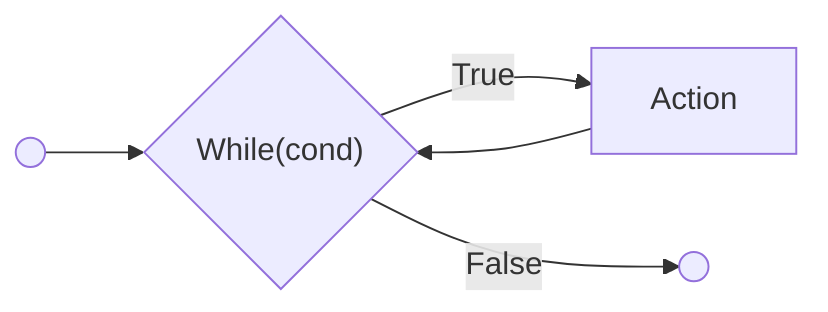
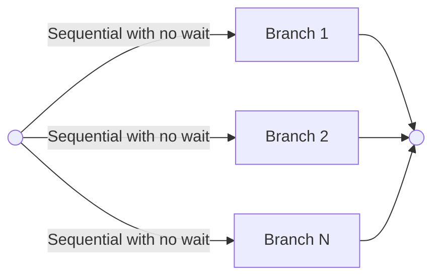

## Glossary

| ID  | Name     | Description  |
|-----|---------|---------|
| 1   | Thread   | OS Thread  |
| 2   | Task     | Unit of execution (in particular a function) |
| 3   | *Worker | Container for keeping a thread, task queue and other entities to allow **Task** execution |
| 4   | Engine | Collection of **Workers** for async/wait together with their queues for **Tasks** |
| 5   | Executor | Responsible for handling **Future** based API of **Task** to progress toward its finish|
| 6   | Scheduler | Responsible for putting **Task** into right queue and notifying others (WIP: to be refined)|
| 7   | Async Runtime (abbr Runtime/ async_runtime) | General name for the entity that delivers **async/await** execution together with all other extensions (dedicated threads etc) |


### References

1. Tokio scheduler design - https://tokio.rs/blog/2019-10-scheduler
2. Hackaton impl of a runtime (can be good to see where we heading too with idea) - https://github.com/qorix-group/performance_stack_rust/tree/pawelrutka_hackaton/hackaton
3. ...


## Async runtime

### General description

The `Async Runtime` should provide to users a way to execute `Tasks` which are either fully cooperative (`async/await`) or plain old sync `functions`. The idea is to take out of a user whole burden of managing `os threads` and simply be able to put work (`Task`) into runtime and just wait (either sync or await like) for the result.


### Requirements

```
Runtime should allow scheduling a Task that can be representing either a sync callable or async callable
```

```
When scheduling a Task that is potentially blocking or long running (as long running CPU intensive), runtime should provide means to indicate that and offload such task into separate worker.

NOTE: The main reason for this is to allow such Tasks run without disturbing the cooperative runtime.
```

```
Runtime should allow to configure both priority and core affinities for worker pool

NOTE: For now there may be single setting for all used workers underneath

```

```
Runtime should provide internal engine for multiplexing events.

NOTE: This is to provide dispatch engine to wakeup Tasks based on incoming events (Sleeps, High Precision Cyclic Timers, Other IOs)

```

```
Runtime should not do heap allocation and minimize usage of high level synchronization (ie. Mutex)
Dynamic allocation shall be restricted to init phase, further allocation can happen from pre allocated storage at init.

NOTE: Both of this contributes to less deterministic time of execution and hard contention

```


```
OPTIONAL: Not for first iteration (there are rough idea how this can be done, but for now lets leave it)

Runtime should allow scheduling a Task that is **!Send**.

```

### Details

##### Spawning
Below we describe the difference between two spawns and internal behavior

###### Spawn
In this spawn, `Task` is put into a queue of current worker thread. This `Task` will be processed by either current thread or other thread that will `steal` this Task.
The `Task` can be polled many times, until it's ready and each poll may happen from different thread. Yet it will never be pulled simultaneously from N threads.

###### Spawn dedicated
In this spawn, `Task` is put into worker queue based on `dedicated worker index`. The dedicated workers does use different task search strategy than normal workers.
They only inspect its own queue for a work and if empty, they go into sleep and wait for new work. This ensures that scheduled tasks does not `travel` across threads during it's lifetime.

> [!QUESTION]
> Shall be make `!Send` tasks only being spawned in such workers only, or we say that we need to resolve it on higher, not runtime level.? (ie and action with future that Stash 
a pointer to boxed `!Send` object and spawns it using dedicated worker index)


##### Allocations

###### Startup
On startup we can freely use allocations (Arc, std::mem, Box etc) to build up all blocks that we need.

###### Program runtime
Dynamic allocation shall generally not be done at all. However to implement `async_runtime` we need to do some allocations. There are two approaches we can take:

1. Single allocation: `Arc<dyn Task>`

The `Task` can look like this:

```rust
pub struct Task<T> {
    ...
    future: T,
    ....
}

```

This allows us to capture Future into task and allocate it together. However the size of future **heavily vary** from one to another (depends on captures, etc) which will make hard to use any `MemPool` like allocator for this.

2. Two allocations: `Box<dyn Future, CustomAllocator>` + `Arc<dyn Task>`

```rust
pub struct Task<T> {
    ...
    future: Box<dyn Future, T>,
    ....
}

```

This approach will give us `const` size of `Task` so we can compute how much items we need, thus derive information needed for simple `MemPool` or other allocator.


> [DECISION]
> For now we take approach **2** pushing allocation issue of Future out of **async_runtime**. We still however need to ask user to deliver us type/instance of allocator at beginning
> so we can use it on this behalf (in spawn::* API layer only).


##### Task Queue for async workers
Each Worker will **have single FIFO queue** with constant size allocated at init phase. The queue will be implemented as Single-Producer-Multiple-Consumer (aka. SPMC) without using high level synchronization (Mutexes). The basis for implementation is implementation in `tokio` (derived from `GOLang`) - https://tokio.rs/blog/2019-10-scheduler . However at start we will probably simplify a bit stealing part and notification about changes.

There will be also a **Global FIFO Queue** that is shared among all `async_workers` which is Multi-Producer-Multi-Consumer. This queue lets offload a batch of tasks spawns on given worker so they can be picked up later or by others, free workers. Since this is only a `pessimistic` path for scheduling work, this queue can potentially use high level sync primitives like `Mutex`.


##### Task Queue for dedicated workers
**WIP**

Probably MPSC queue, because many can schedule task there, but only dedicated worker can pick it up (no stealing), and task returning `pending` will eventually be again polled in same worker.

#### Outlook of how Task lifetime looks like 
This presents case if thread queue has empty space to push task




The `Task` lifetime is hold artificially by a `Waker` which hold `raw` pointer to `Task`, but before it makes sure `ref count` was increased.
This means `Task` will be alive on `heap` until all `Wakers` are destroyed and `Task` is no longer in queue.


#### Class diagram

```plantuml

skinparam wrapWidth 300
top to bottom direction

package core {
 
    enum TaskStage<T: Future> {
        InProgress(Box<T>),
        Completed(RoutineResult),
        Extracted // Result Value was taken of
    }

    class TaskState {

    }

    class Task<T> {
    - state: TaskState
    - stage: TaskStage<T>
    - id: u64
    - join_handle_waker: Option<Waker> 
    }
    note top of Task
    join_handle_waker : This needs a wrapping into something thread safe probably 
    (maybe enough with UnrestrictedAtomic from iceoryxbb)
    endnote

    Task *-- TaskState
    Task *-- TaskStage
    Task -u-|> TaskTrait

    interface TaskTrait {
        fn poll(&self, cx: &mut Context<'_>) -> Poll<bool>;
        ...
    }

    class Waker {
    ...
    }

    class RawWakerImpl {
        ptr: Task* // Ptr obtained from Arc<>
        ...
    }
    note left of RawWakerImpl
    Impl using VTable
    endnote

    Waker *-- RawWakerImpl


    JoinHandle --> Task: Uses task to extract return value

    Waker ..> Task: Holding Arc<> lifetime

}

class ThreadTaskQueue<T> {
}

class WorkersSharedState {
    + get_owned_queue(worker_id): Arc<ThreadTaskQueue>
    + get_steal_queues(): Collection<StealHandlers>
}

note bottom of WorkersSharedState
This lets all async threads have access to their queues, notifiers,
state of searching and so on.
end note

class Worker {
    - thread: std::thread::JoinHandle
    - queue: &ThreadTaskQueue<Arc<dyn TaskTrait>>
    - queue_fetch_strategy: WIP_Type
    - ...
}

note right of Worker
Idea: queue_fetch_strategy: Used to setup strategy for gathering Tasks from queue.

endnote

Worker --> WorkersSharedState
WorkersSharedState o-- ThreadTaskQueue: 1..N

class JoinHandle<T> {
    for_task: Arc<Task>
    ...
}


class TLSWorkerContext {

}

note top of TLSWorkerContext
Thread Local Storage object that 
is used by API as entry point to runtime.

endnote

class ExecutionEngine {
    - async_workers: Vec<Worker>,
    - async_queues: WorkersSharedState,

    - global_queue: MPMCQueueType

    + id() -> Id;
}


class DedicatedWorker {
    - thread: std::thread::JoinHandle
    - queue: MPSCQueue,
    - priority: u32
    - affinity: u32
}

note bottom of DedicatedWorker
Special worker that can process Task, and can have different priority than async_workers. It also guarantee that work put here will be
processed only in this worker each time **poll** is called on **Task**.
end note

class AsyncRuntime {
    - async_engine: ExecutionEngine,
    - dedicated_workers: HashMap<id, DedicatedWorker>,

    - io_driver: IODriver //TODO: Handle later
}

note top of AsyncRuntime
There will be probably a need to encapsulate parts of members into "Handles" so we can distribute access to parts of it to different entities.
endnote

ExecutionEngine *-- Worker: 1..N

AsyncRuntime *-- ExecutionEngine: 1..N
ExecutionEngine *-- WorkersSharedState

AsyncRuntime *-- DedicatedWorker: 1..N

```


#### Sequence diagrams

```plantuml
title Processing tasks

database "Thread Task Queue" as tq

box Thread in WorkerPool
participant worker
participant executor
participant task
endbox

loop
    worker -> tq: pop()

    alt pop not empty
        worker -> executor: execute_task(task)
        
        executor -> executor: check_if_task_shall_be_executed()

        alt NO
            executor -> worker
        else YES
        
            executor -> executor: create_waker_and_ctx() -> ctx
            executor -> task: poll(ctx)
            task --> executor: Poll::Status

            alt Poll::Ready
                executor -> task: finalize()   
            end
        end
    else pop empty
        worker -> worker: search_for_work()
        note right
            Here worker goes into searching state and looks for work:
                - checks siblings workers to steel from them
                - checks if global queue have something to steel
          
        endnote

        alt WORK_NOT_FOUND
            worker -> worker: wait_for_wakeup()
            note right
                We wait for a signal to wake us up
            endnote
        end
    end
end

```

```plantuml
title Spawn a task from runtime


box Thread in WorkerPool
actor User as user

participant runtime


participant scheduler<<WIP: Part of Worker?>>

endbox

database "Thread Task Queue" as tq


user -> runtime: spawn(function/future)
runtime -> runtime: get_local_ctx()
note right
Each worker have thread_local(CTX) that it used to access all code
entities to perform actions on runtime. 
The foremost thing is that spawn is adding a TASK into LOCAL TASK thread queue
and only fall backs to global queue if there is not enough room.
endnote

runtime -> runtime: create_task_from_future()
runtime -> scheduler: spawn_task(task)
scheduler -> tq: push(task)
scheduler -> scheduler: notify_others_if_needed()
note right
WIP: How and who notifies, not yet clear, some idea:
When we push to queue, our worker is awake anyway so we dont need to wake up him.
However others may be sleeping, notify sibling worker/s if they are in IDLE state.
endnote


runtime --> user: JoinHandle
note right
User can use handle to await on competition and fetch result, 
or drop handle and don't care.
endnote
```


### API Proposal

[API File](assets/api_proposal.rs)


## Orchestration

### Supported actions
To build program with a task chain, we need to provide basic `actions`. 

#### Sequence
Can combine multiple other `actions` as a sequential chain of steps executed one after another



This type of action shall execute its `steps` in place, means no `async_runtime::spawn::*` need to happen

#### Concurrent

Can combine multiple other `actions` that will be executed concurrently


This type of action shall execute its `branches` as concurrently as possible. It means it shall `async_runtime::spawn*` to let runtime do do job ASAP.

#### IfElse

Can be build from `two` different `actions` and need to provide a way to capture condition provider



This type of action shall execute its `branch` in place, means no `async_runtime::spawn::*` need to happen because at the end this is same as `Sequence`.


#### Switch 

Can be build from `N` different `actions`, the `default action` and need to provide a way to capture condition provider



#### Loop (Do we need this ?)

Can be build from single `action`



#### Invoke
It is lowest level action that can encapsulate:
- function
- async function
- callable

and execute it in place.

#### SyncEvent

Can wait for `multiple` events to occur and then unblocks

#### TrigEvent

Triggers `multiple` events and continue

#### FlowSplit (??? ;) )



This type of action shall execute it's `branches` in `Sequence` but it shall not wait until each branch will finish. Instead when one branch returns `Pending` it shall immediately goes to next one.

> [!QUESTION]
> **Do we know real use case for it ?**


#### Try-Catch

Can be build from single `action` and single `catch action`. Returning any error in contained action (and in descendant chain) shall result in execution of `catch action`.


#### Timebox (do we allow this in each action or we do separate action for it ?)

## Open questions out of head

> [!Q1]
